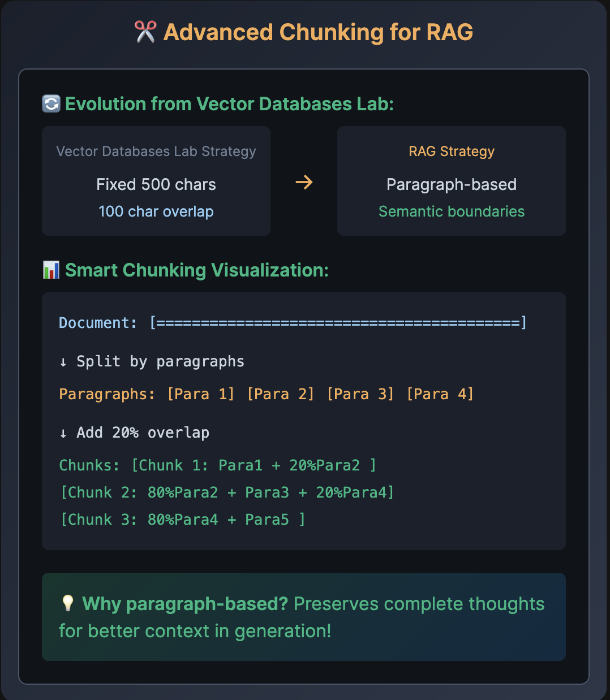

# ✂️ Advanced Chunking for RAG



💡 Why paragraph-based? Preserves complete thoughts for better context in generation!

# 📄 Task 2: Smart Document Processing

## 📝 Process TechCorp Documents

📁 Select task_2_document_processing.py from the explorer

✏️ Complete the TODOs:

    Line 26-28: Split text by double newlines "\n\n"
    Line 42-44: Calculate overlap with overlap_ratio
    Line 63-68: Add metadata with doc_file.name and category_dir.name

📂 Processing: /root/techcorp-docs/ (policies, products, support)
🚀 Run Command
python3 /root/code/task_2_document_processing.py

## Code explaination

Let’s break this code down step by step 👇

---

## 🧠 **Overall Purpose**

This code is **processing markdown documents**, **splitting them into smart overlapping chunks**, and then **storing each chunk (with embeddings and metadata)** into a **vector database** for later use — e.g., for semantic search or retrieval-augmented generation (RAG).

---

## 🔹 **Part 1 — The `smart_chunk_document` function**

```python
def smart_chunk_document(text, overlap_ratio=0.2):
    """
    Smart paragraph-based chunking with overlap
    """
```

### Goal:

Split a large document into smaller, meaningful “chunks” based on paragraphs — not arbitrary lengths — with some **content overlap** for better context retention between chunks.

---

### Step-by-step:

#### 1️⃣ Split document into paragraphs

```python
paragraphs = text.split("\n\n")
```

* Splits the document whenever it finds **two consecutive newlines (`\n\n`)**, which usually separate paragraphs in markdown or plain text files.

---

#### 2️⃣ Initialize chunks list

```python
chunks = []
```

Will store all generated chunks.

---

#### 3️⃣ Loop through each paragraph

```python
for i in range(len(paragraphs)):
    chunk_parts = []
```

For each paragraph `i`, we’ll build one “chunk” by combining:

* the current paragraph,
* possibly the next one (for smoother reading),
* and a bit of overlap from the previous one.

---

#### 4️⃣ Add the current and next paragraph

```python
chunk_parts.append(paragraphs[i])
if i + 1 < len(paragraphs):
    chunk_parts.append(paragraphs[i + 1])
```

So each chunk includes the **current paragraph and the next one** (unless it’s the last one).

This ensures continuity across chunks.

---

#### 5️⃣ Add overlapping portion from previous paragraph

```python
if i > 0 and overlap_ratio > 0:
    overlap_chars = int(len(paragraphs[i-1]) * overlap_ratio)
    if overlap_chars > 0:
        chunk_parts.insert(0, paragraphs[i-1][-overlap_chars:])
```

If there’s a previous paragraph, it includes the **last 20%** of that paragraph at the beginning of this chunk (as overlap).

✅ This helps preserve context between chunks, which is crucial for LLM retrieval or summarization.

---

#### 6️⃣ Combine and add the chunk

```python
chunk = " ".join(chunk_parts)
chunks.append(chunk)
```

---

#### ✅ Return all chunks

```python
return chunks
```

So `smart_chunk_document("...")` → returns a list like:

```python
[
  "ending of previous paragraph ... paragraph 1 paragraph 2",
  "last part of paragraph 1 paragraph 2 paragraph 3",
  ...
]
```

---

## 🔹 **Part 2 — Processing the Documents**

### 1️⃣ Directory structure

```python
doc_dir = Path("/root/techcorp-docs")
```

* Root directory containing markdown files grouped into subfolders (categories/sections).

Example:

```
/root/techcorp-docs/
    ├── HR/
    │   ├── policy.md
    │   ├── benefits.md
    ├── Engineering/
        ├── architecture.md
        ├── onboarding.md
```

---

### 2️⃣ Loop through folders

```python
for category_dir in doc_dir.iterdir():
    if category_dir.is_dir():
        ...
```

Each subfolder is treated as a **category or section**.

---

### 3️⃣ Process markdown files

```python
for doc_file in category_dir.glob("*.md"):
```

For each markdown document under that section…

---

### 4️⃣ Create metadata

```python
metadata = {
    "source": doc_file.name,
    "section": category_dir.name
}
```

So each chunk stores where it came from — useful for search filtering or display later.

Example:

```python
{'source': 'benefits.md', 'section': 'HR'}
```

---

### 5️⃣ Read file contents

```python
with open(doc_file, "r") as f:
    content = f.read()
```

---

### 6️⃣ Chunk the content

```python
chunks = smart_chunk_document(content)
```

---

### 7️⃣ Encode and store chunks

```python
for i, chunk in enumerate(chunks):
    chunk_id = f"{category_dir.name}_{doc_file.stem}_chunk_{i}"
    embedding = model.encode(chunk).tolist()

    collection.add(
        ids=[chunk_id],
        embeddings=[embedding],
        documents=[chunk],
        metadatas=[metadata]
    )
```

Here’s what’s happening:

* `model.encode(chunk)` → converts text into a **vector embedding** (numerical representation for similarity search).
* Each chunk is added into the **vector database (`collection`)** with:

  * A unique ID (based on file name and index)
  * Its embedding
  * Original chunk text
  * Metadata

So later, you can query this collection using semantic similarity or keyword-based retrieval.

---

### 8️⃣ Keep track and print progress

```python
print(f"   ✅ {doc_file.name}: {len(chunks)} chunks")
```

---

### 9️⃣ Summary

At the end, it prints stats:

```python
print(f"   - Documents processed: {docs_processed}")
print(f"   - Total chunks created: {total_chunks}")
print(f"   - Collection size: {collection.count()}")
```

---

## ✅ **Summary of What This Code Does**

| Step | Action                           | Purpose                             |
| ---- | -------------------------------- | ----------------------------------- |
| 1    | Splits documents into paragraphs | Logical chunking based on structure |
| 2    | Adds overlapping parts           | Maintain context between chunks     |
| 3    | Creates metadata                 | Track source and category           |
| 4    | Generates embeddings             | Prepare for vector search           |
| 5    | Stores in vector DB              | Enables semantic retrieval later    |

---

Would you like me to **optimize** this chunking logic (e.g., handle max token size or avoid redundant overlaps for small paragraphs)?
It’s quite useful if you’re integrating this into a **RAG pipeline** or **document QA system**.
