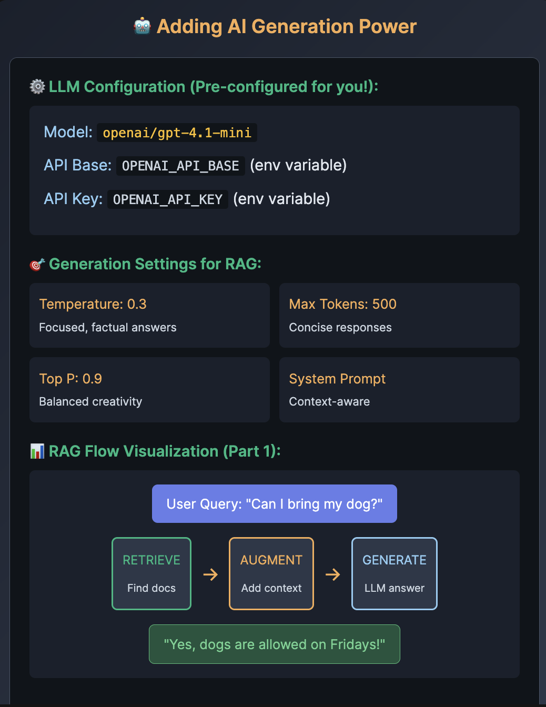

# 🤖 Adding AI Generation Power

## 🤖 Task 3: LLM Integration
📝 Configure AI Generation Engine

📁 Select task_3_llm_integration.py from the explorer

✏️ Complete the TODOs:

    Lines 20-22: Initialize ChatOpenAI with api_key, base_url, "openai/gpt-4.1-mini"
    Line 34: Set temperature to 0.3
    Line 38: Set max_tokens to 500

💡 Test: Simple generation before adding RAG complexity
🚀 Run Command
python3 /root/code/task_3_llm_integration.py