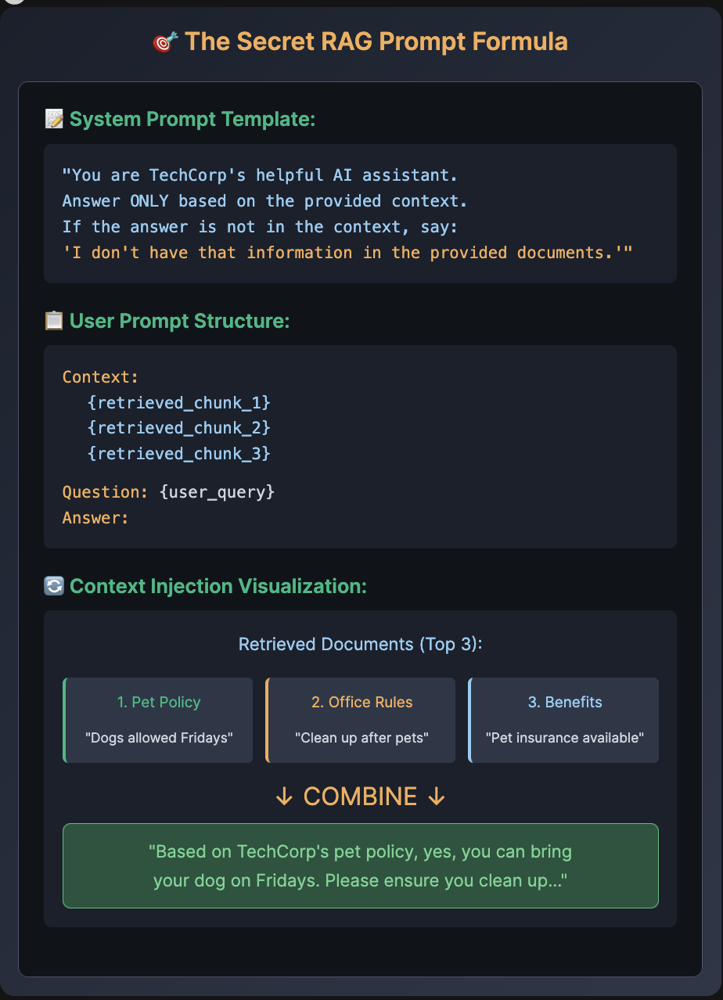

# 🎯 The Secret RAG Prompt Formula

# 📝 Task 4: Prompt Engineering

📝 Build the RAG Prompt Template

📁 Select task_4_prompt_engineering.py from the explorer

✏️ Complete the TODOs:

    Line 32: Complete system prompt with "ONLY"
    Line 42: Build context with chunk variable
    Line 49: Complete user prompt with user_question

🎯 Goal: Create prompts that ensure accurate, context-based answers

🚀 Run Command
python3 /root/code/task_4_prompt_engineering.py