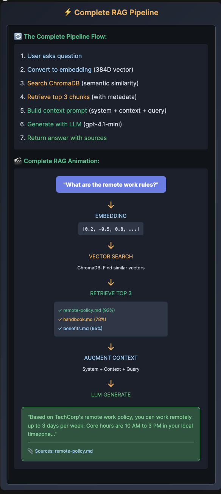

# ⚡ Complete RAG Pipeline

🔄 The Complete Pipeline Flow:

    User asks question
    Convert to embedding (384D vector)
    Search ChromaDB (semantic similarity)
    Retrieve top 3 chunks (with metadata)
    Build context prompt (system + context + query)
    Generate with LLM (gpt-4.1-mini)
    Return answer with sources

🎬 Complete RAG Animation:
"What are the remote work rules?"
↓
EMBEDDING
[0.2, -0.5, 0.8, ...]
↓
VECTOR SEARCH
ChromaDB: Find similar vectors
↓
RETRIEVE TOP 3
✓ remote-policy.md (92%)
✓ handbook.md (78%)
✓ benefits.md (65%)
↓
AUGMENT CONTEXT
System + Context + Query
↓
LLM GENERATE
"Based on TechCorp's remote work policy, you can work remotely up to 3 days per week. Core hours are 10 AM to 3 PM in your local timezone..."
📎 Sources: remote-policy.md

# 🚀 Task 5: Complete RAG Pipeline

📝 Wire Everything Together!

📁 Select task_5_complete_rag.py from the explorer

✏️ Complete the TODOs:

    Lines 45-46: Semantic search with query_embedding and n_results=3
    Lines 61-63: System prompt (already complete - review it)
    Line 71: Add user_question to prompt
    Lines 81-82: Create messages with system_prompt and user_prompt
    Line 93: Format response with unique_sources

🎯 Final Test: Complete Q&A system with source attribution!
🚀 Run Command
python3 /root/code/task_5_complete_rag.py