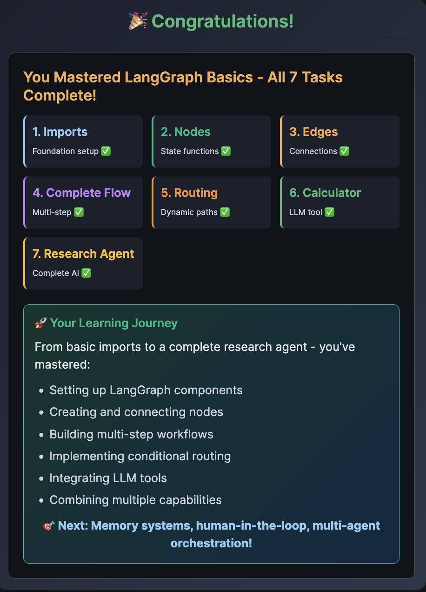

# COngradulations

🚀 Your Learning Journey

From basic imports to a complete research agent - you've mastered:

    Setting up LangGraph components
    Creating and connecting nodes
    Building multi-step workflows
    Implementing conditional routing
    Integrating LLM tools
    Combining multiple capabilities

🎯 Next: Memory systems, human-in-the-loop, multi-agent orchestration!

