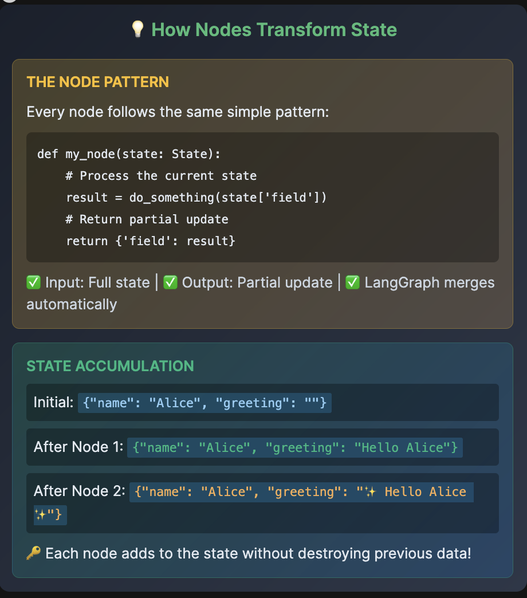

# 💡 How Nodes Transform State

THE NODE PATTERN

Every node follows the same simple pattern:
```
def my_node(state: State):
    # Process the current state
    result = do_something(state['field'])
    # Return partial update
    return {'field': result}
```

✅ Input: Full state | ✅ Output: Partial update | ✅ LangGraph merges automatically

