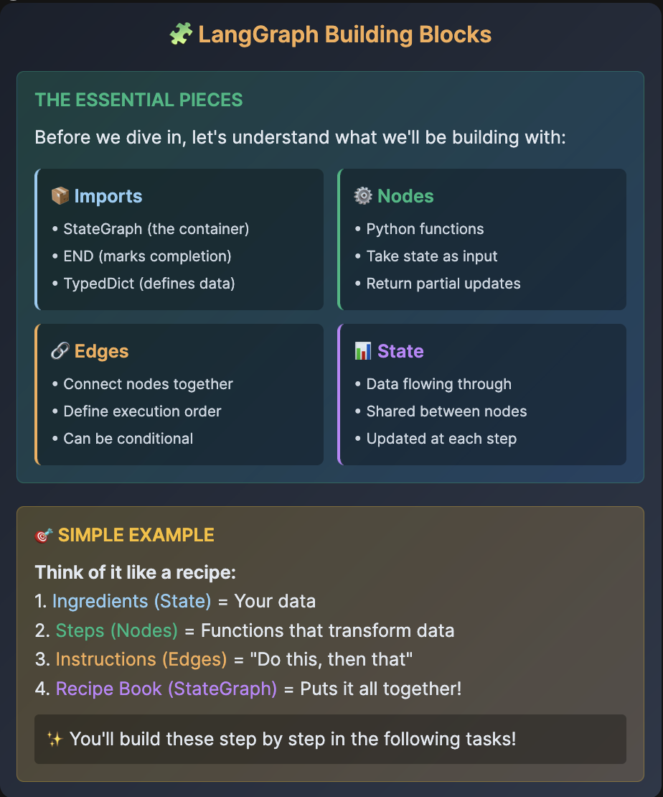

# 🧩 LangGraph Building Blocks

## THE ESSENTIAL PIECES
Before we dive in, let's understand what we'll be building with:

### 📦 Imports

• StateGraph (the container)
• END (marks completion)
• TypedDict (defines data)

### ⚙️ Nodes

• Python functions
• Take state as input
• Return partial updates

### 🔗 Edges

• Connect nodes together
• Define execution order
• Can be conditional

### 📊 State

• Data flowing through
• Shared between nodes
• Updated at each step

## 🎯 SIMPLE EXAMPLE

Think of it like a recipe:

1. Ingredients (State) = Your data
2. Steps (Nodes) = Functions that transform data
3. Instructions (Edges) = "Do this, then that"
4. Recipe Book (StateGraph) = Puts it all together!

> ✨ You'll build these step by step in the following tasks!

# 📚 Task 1: Understanding Imports

## 🎯 Setting Up LangGraph Basics

📁 Select task_1_understanding_imports.py from the explorer

✏️ Complete the TODOs:

    Line 26: Import modules: from langgraph.graph import StateGraph, END
    Line 30: Import TypedDict: from typing import TypedDict
    Line 35: Define messages field: messages: list

> 💡 Key Learning: StateGraph creates workflows, END marks completion, State holds data

🚀 Run Command
`python3 /root/code/task_1_understanding_imports.py`