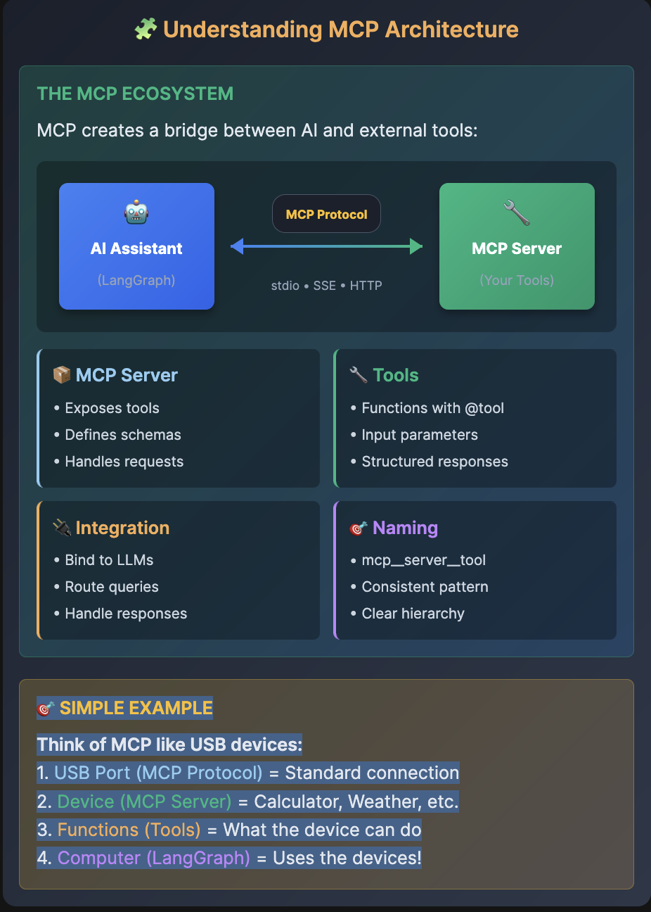

# 🧩 Understanding MCP Architecture

THE MCP ECOSYSTEM

MCP creates a bridge between AI and external tools:

🎯 SIMPLE EXAMPLE

Think of MCP like USB devices:
1. USB Port (MCP Protocol) = Standard connection
2. Device (MCP Server) = Calculator, Weather, etc.
3. Functions (Tools) = What the device can do
4. Computer (LangGraph) = Uses the devices!

